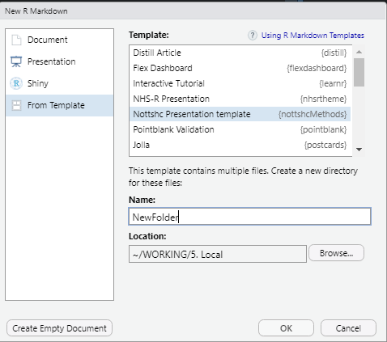

<!-- README.md is generated from README.Rmd. Please edit that file -->

# nottshcMethods

<!-- badges: start -->
<!-- badges: end -->

The goal of nottshcMethods is to help us analyse our data faster and
better.

## Installation

You can install the the development version from
[GitHub](https://github.com/) with:

``` r
# install.packages("devtools")
devtools::install_github("CDU-data-science-team/nottshcMethods")
```

## Nottinghamshire Healthcare NHS Foundation Trust slides

Once the package is installed, xaringan presentation slides with
Nottinghamshire Healthcare NHS Foundation Trust branding can be access
easily using the RStudio IDE, by selecting `File` -&gt; `R markdown ...`
-&gt; `From Template`.



## Code of Conduct

Please note that the nottshcMethods project is released with a
[Contributor Code of
Conduct](https://contributor-covenant.org/version/2/0/CODE_OF_CONDUCT.html).
By contributing to this project, you agree to abide by its terms.
